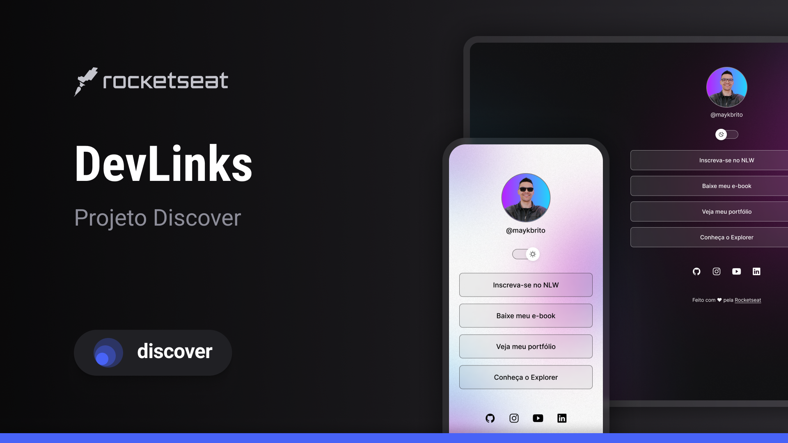

<h1 align="center"> DevLinks </h1>

Free program, promoted by Rocketseat for teaching WEB technologies.

  <a href="#-tecnologias">Tecnology</a>&nbsp;&nbsp;&nbsp;|&nbsp;&nbsp;&nbsp;
  <a href="#-projeto">Projects</a>&nbsp;&nbsp;&nbsp;|&nbsp;&nbsp;&nbsp;
  <a href="#-layout">Layout</a>&nbsp;&nbsp;&nbsp;|&nbsp;&nbsp;&nbsp;
  <a href="#memo-licença">License</a>

  

 

  

## 🚀 Tecnology

This project was developed with the following technologies:

- HTML e CSS
- JavaScript
- Git e Github

## 💻 Project

DevLinks is an aggregator of useful links to use as an online business card.

## 🔖 Layout

You can view the project layout through [THIS LINK](https://www.figma.com/file/LiOTED8PPKSp7aBvVWI8tp/DevLinks-%E2%80%A2-Projeto-Discover-(Community)?type=design&node-id=10%3A620&mode=design&t=edJUEksWXxp6kPp8-1). You need to have an account on [Figma](https://figma.com) to access it.

## :memo: License

Esse projeto está sob a licença MIT.

---

Feito com ♥ by Rocketseat :wave: [Participe da nossa comunidade!](https://discord.gg/rocketseat)
